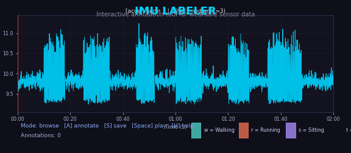

# IMU Labeler

**Free, open-source GUI tool for labeling IMU and time-series sensor data** — with optional synchronized video playback.

Built for researchers and engineers who work with wearable sensors (accelerometers, gyroscopes, magnetometers) and need a fast, keyboard-driven way to annotate activities in their data.



## Features

- **Interactive signal visualization** — plot accelerometer/gyroscope magnitude with zoom, pan, and real-time scrubbing
- **Synchronized video playback** — hover over the signal plot to scrub the video to that exact timestamp
- **Configurable labels** — define your own activity categories, colors, and keyboard shortcuts via YAML
- **Auto-detect sensor columns** — automatically finds `(x, y, z)` column groups in your CSV
- **Keyboard-driven workflow** — drag to select, press a key to label. Undo, delete, edit with shortcuts
- **Auto-save** — annotations are saved on every add/delete/edit
- **Timestamp resampling** — smooths jittery sensor timestamps using windowed-mean averaging
- **Video time-stretching** — automatically aligns video duration to sensor session via FFmpeg
- **Reference label overlay** — compare your annotations against a reference set
- **Signal filtering** — median, Gaussian, or moving-average filters built in
- **Works without video** — IMU-only mode for datasets without video

## Installation

```bash
pip install git+https://github.com/ameyrane98/imu-labeler.git
```

Or clone and install locally:

```bash
git clone https://github.com/ameyrane98/imu-labeler.git
cd imu-labeler
pip install -e .
```

### Requirements

- Python 3.9+
- FFmpeg (optional, for video stretching)
- Tk backend for matplotlib (`python3-tk` on Linux)

## Quick Start

### 1. Try with sample data

```bash
# Generate synthetic IMU data
python examples/generate_sample_data.py

# Launch the labeler
imu-labeler examples/sample_data/
```

### 2. Use with your own research data

**Step 1:** Put your sensor CSV in a folder. Your CSV needs a timestamp column and sensor columns with `_x`, `_y`, `_z` suffixes (e.g., `accel_x`, `accel_y`, `accel_z`). See [CSV Format](#csv-format) below.

**Step 2:** (Optional) If you have a synchronized video, place the `.mp4` file in the same folder.

**Step 3:** Point the tool at your data folder:

```bash
imu-labeler /path/to/your/data/
```

The tool auto-detects:
- The first `.csv` file as sensor data
- Any `.mp4` / `.avi` / `.mov` as the video
- Any `.json` as video timing metadata
- Sensor columns with `_x`, `_y`, `_z` suffixes

**Step 4:** Annotate! Press `A` to enter annotate mode, drag to select a time span, then press a label key. Your annotations are auto-saved to `annotations.csv` in the data folder.

### 3. Customize labels for your project

The default labels are `w` (Walking), `r` (Running), `s` (Sitting), `t` (Standing). To define your own, create a `config.yaml` in your data directory:

```yaml
labels:
  d:
    name: Drinking
    color: "#ff6b6b"
    key: d
  e:
    name: Eating
    color: "#ffd93d"
    key: e
  c:
    name: Cooking
    color: "#6bcb77"
    key: c
```

You can define as many labels as you need — each gets a keyboard shortcut, a color, and a display name.

### 4. Use annotations in your ML pipeline

The output `annotations.csv` is a simple format you can load directly into your training pipeline:

```python
import pandas as pd

annotations = pd.read_csv("annotations.csv")
# columns: start, stop, label
# Use start/stop timestamps to slice your sensor data into labeled segments
```

## Controls

| Action | Key / Mouse |
|--------|------------|
| Play / Pause | `Space` |
| Jump +/- 5 sec | `Arrow keys` |
| Zoom | `Scroll wheel` |
| Toggle annotate mode | `A` |
| Select span | `Drag` on plot |
| Set start / stop | `[` then `]` |
| Assign label | Press label key (e.g., `w`, `r`, `s`) |
| Delete annotation | `Right-click` on colored span |
| Edit label | `Double-click` on colored span |
| Undo | `Ctrl+Z` |
| Save | `S` (also auto-saves) |
| Help | `H` |

## CLI Options

```
imu-labeler [data_dir] [options]

Arguments:
  data_dir          Directory with sensor CSV (default: current dir)

Options:
  -c, --config      Path to YAML config file
  --csv             Path to sensor CSV (overrides auto-detection)
  --video           Path to video file
  --no-video        Disable video even if one is found
```

## CSV Format

Your sensor CSV should have:

1. **A timestamp column** — named `timestamp`, `UTC_Timestamp`, `time`, or similar
2. **Sensor columns in (x, y, z) groups** — e.g., `accel_x`, `accel_y`, `accel_z`

Example:

```csv
timestamp,accel_x,accel_y,accel_z,gyro_x,gyro_y,gyro_z
0.000,0.12,-0.34,9.78,1.2,-0.5,0.3
0.020,0.15,-0.31,9.81,1.1,-0.4,0.2
...
```

The tool computes the magnitude `sqrt(x^2 + y^2 + z^2)` for visualization.

## Output

Annotations are saved as CSV:

```csv
start,stop,label
1234567.1234,1234569.5678,w
1234572.0000,1234575.3456,r
```

## Background

This project grew out of my current research work, where I needed a fast way to annotate wearable IMU sensor data synchronized with video. I generalized the internal tool into this open-source project so anyone working with IMU data can benefit from a purpose-built labeling workflow.

## License

MIT
